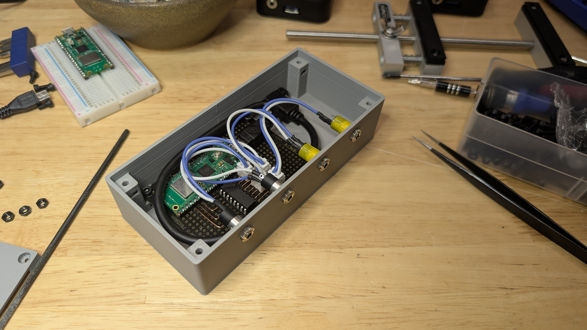
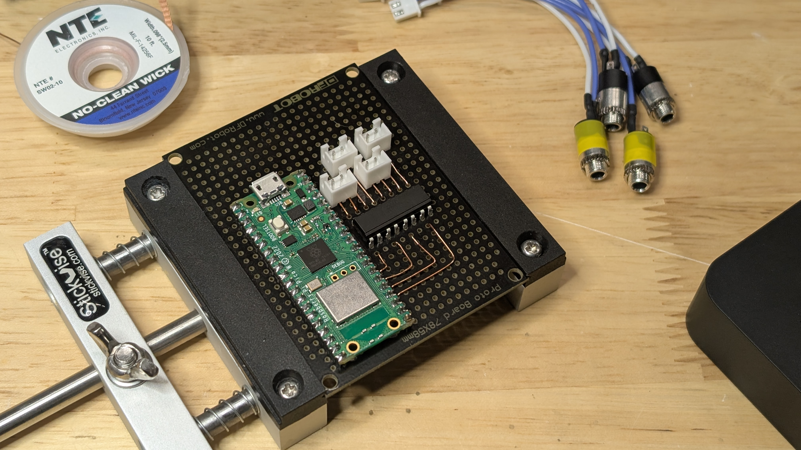

# Remote Switcher

A four channel MQTT-controlled button pusher.

## More Info

The accompanying blog post can be found here. TODO

TL;DR - I have 2 KVMs and 2 USB switchers that can be controlled externally by buttons connected via 3.5mm audio cables. I want to be able to press those buttons remotely, and this does that for me.

## In this Repo
- Arduino code for the Pi Pico is in the `/code` folder
- FreeCAD project file, STLs, and gcode for an Ender 3 are in the `/cad` folder
- KiCad schematic is in the `/schematic` folder

## BOM
- 1 x Pi Pico W
- 4 x 3.5mm barrel connectors ([DigiKey Link](https://www.digikey.com/en/products/detail/lumberg-inc/1502-08/25602801))
- 1 x LTV-846 four channel optoisolator ([DigiKey Link](https://www.digikey.com/en/products/detail/liteon/LTV-846/385834))
- 1 x Panel-mount USB Micro cable ([DigiKey Link](https://www.digikey.com/en/products/detail/adafruit-industries-llc/3258/6238006))
- 1 x Perfboard ([DigiKey Link](https://www.digikey.com/en/products/detail/dfrobot/FIT0099/6588422))
- 1 x 3d printed enclosure (box and lid)
- 8 x M2 nuts
- 8 x M2 socket head bolts
- 4 x 2-pin JST connectors
- Misc wires, heat shink tubing

